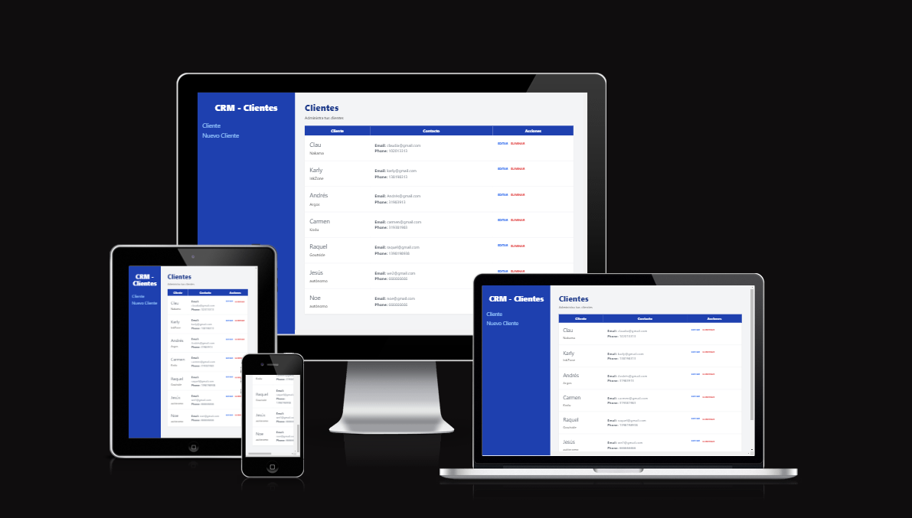

# CRM - Clientes

## Tabla de Contenido.
1. [Descripción](#descripción)
2. [Tecnologías](#tecnologías)
3. [Instalación](#Instalación)

### 📝 Descripción

CRM para la gestión de clientes, podrás crear, editar y eliminarlos.
Proyecto para prácticar con las nuevas integraciones de la última versión de React Router Dom y con Tailwindcss.

### 💻 Tecnologías

- React JS
- React Route DOM v6.4 utilizando loaders y action
- TailwindCss
- JSON Server
- Vite

### 💾 Instalación

1. Instalar los paquetes : `$ npm install`
2. Instalar JSON Server : `$ npm install -g json-server`
3. Comenzar JSON Server: `$ npm run api`
4. Inicia el servidor de desarrollo : `$ npm run dev`

## 🚀 Proyecto desplegado :

https://euphonious-flan-c3bb1d.netlify.app/
